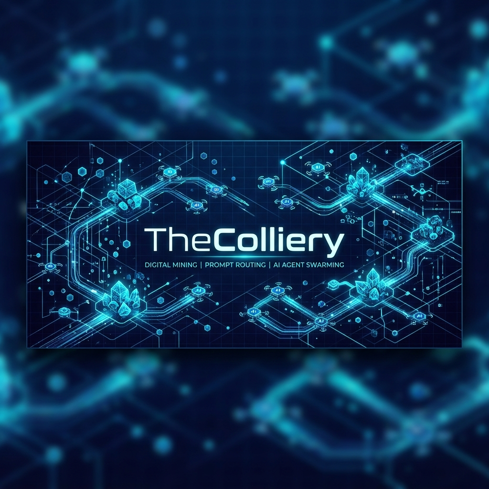

  

  <strong>Quality tooling for AI coding agents — mined, sorted, and shipped.</strong>

  
  
  

---

## 🏗️ What is TheColliery?

A *colliery* is the complete coal mining operation: the mine, the tipple, and the workspace that turns a raw underground seam into clean, burning fuel. 

**TheColliery** is a series of small, sharp, offline-first tools designed to keep AI coding agents honest, secure, and blazing fast. We build the infrastructure that helps agents execute safely, coordinate concurrently, and optimize their token budgets without sacrificing quality.

---

## ⛏️ The Series Suite

The Colliery structures its tools based on the processing stages of raw digital coal:

| Project | Stage | Status | Concept |
| :--- | :--- | :--- | :--- |
| **[CoalMine](https://github.com/HetCreep/CoalMine)** | *Extraction* | **Live** (`v3.5.1`) | Nine quality-**canary** skills (resilience, security, caching, testability, grounding) to equip agents for raw, safe code extraction. |
| **[CoalTipple](https://github.com/TheColliery/CoalTipple)** | *Sorting* | **Design Only** | A semantic routing layer featuring **Delegation** and **Escalation** modes to distribute tasks dynamically across a 5-tier model matrix. |
| **[CoalFace](https://github.com/TheColliery/CoalFace)** | *Active Front* | **Design Only** | An agent swarming and concurrent orchestration engine designed to split a fixed token budget into parallel workers without logical collisions. |

---

## 📜 The 5 Doctrine Layers

Every tool inside **TheColliery** is governed by our core constitution:

1. 🌐 **Works in Every Mine (Cross-Agent):** Vendor-agnostic universality (works with Claude, Gemini, Cline, Roo Code, Cursor, and custom frameworks).
2. 🦅 **Phoenix 13 Compliance:** Immortality hooks — silent failure, zero external dependencies, sandboxed, deterministic, and network-free.
3. 🔬 **Quantum 11 Performance:** Maximum output, zero visible errors, and consent-gated updates.
4. 🛡️ **Antivirus/ESET Heuristics:** Adaptive fresh checks, signature validations, and secure credential handling.
5. 🔌 **Single Power Button:** Absolute minimal setup. A single command installs and runs the conductor.

---

  <em>More tools and skills are still deep underground. 🔦</em>

