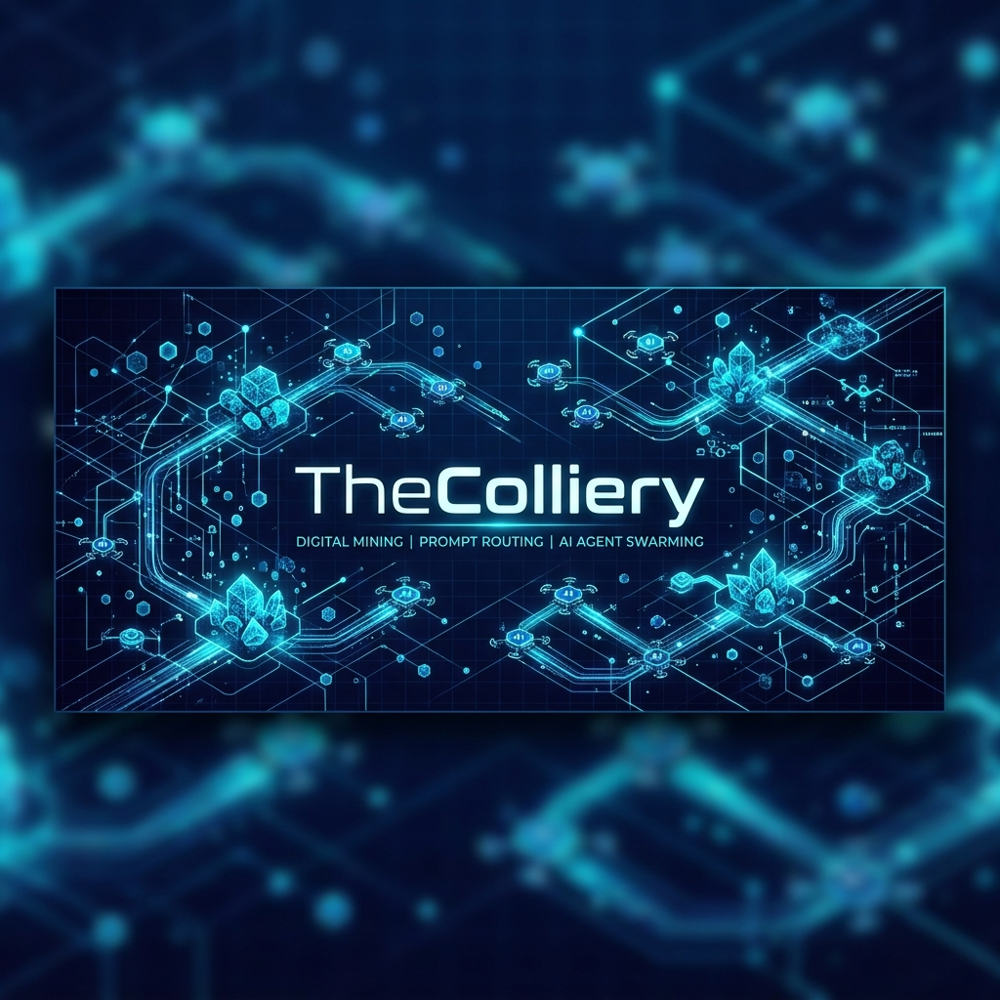

# TheColliery

<p align="center">
  
</p>

<p align="center">
  <strong>Quality tooling for AI coding agents — mined, sorted, and shipped.</strong>
</p>

<p align="center">
  
  
  
  
  
</p>

---

## 🏗️ What is TheColliery?

A *colliery* is the complete coal mining operation: the mine, the tipple, and the workspace that turns a raw underground seam into clean, burning fuel.

**TheColliery** is a series of small, sharp, offline-first tools designed to keep AI coding agents honest, secure, and blazing fast. We build the infrastructure that helps agents execute safely, coordinate concurrently, and optimize their token budgets without sacrificing quality.

---

## ⛏️ The Series Suite

The Colliery structures its tools by the processing stages of raw digital coal:

| Project | Stage | Status | Concept |
| :--- | :--- | :--- | :--- |
| **[CoalMine](https://github.com/HetCreep/CoalMine)** | *Extraction* | **Live**  | Nine quality-**canary** skills (code-health, grounding, supply-chain, resilience, observability, testability, scaling, drift, completeness) plus the auto-cadence hooks that run them unprompted at session start and session end, equipping agents for raw, safe code extraction. |
| **[CoalTipple](https://github.com/TheColliery/CoalTipple)** | *Sorting* | **Live**  | A model/effort **router**: **delegation** (down, to save tokens) and **escalation** (up, for quality), a `qualityBar` staircase, and a fail-safe model-ranking **Lock**. **Claude Code only** — routing actuates only where an agent can pick a spawned worker's model + effort (built and validated across the 2.1.x line). |
| **[CoalBoard](https://github.com/TheColliery/CoalBoard)** | *Governance* | **Live**  | A **consensus & debate board**: on an error-not-allowed task — or any hard problem worth several lenses — with consent, diverse epistemic lenses (empirical/source-grounded · formal · a show-me skeptic) debate in parallel — either verifying new work before it ships (**Generate**) or reporting on existing work (**Audit/Review**) — a judge synthesizes on VERIFIED inputs, an independent solver breaks ties, and the human signs off. Bounded cost + zero-breakage. **Cross-agent** — validated on Claude Code + Antigravity; other concurrent-subagent platforms design-supported. |
| **[CoalHearth](https://github.com/TheColliery/CoalHearth)** | *Session Storage* | **Live**  | A session **warm-resume** engine: a hook journals session state every step, so an interrupted session resumes from a recovery block instead of a manual rebuild. **Reduces** the work lost to a session limit (it does not prevent one). Claude Code (validated) + 6 wired ports (Antigravity, Gemini CLI, Copilot CLI, Devin CLI, Kiro, Augment) — Phoenix-13 hooks. |
| **[CoalFace](https://github.com/TheColliery/CoalFace)** | *Active Front* | **Live**  | The **fan-out discipline**: a mandatory scout sizes the swarm, workers return anchor-edit orders as text, one writer applies behind a snapshot + QC + domain gate, and the whole run is **bounded by the estimated solo $-cost, never a token bound** (raw tokens run higher; bandwidth dial with TCP-style backoff). Disciplines the fan-outs an agent would already do — it does not make models smarter. |
| **[CoalWash](https://github.com/TheColliery/CoalWash)** | *Washing* | **RC**  | A **memory washer/defragmenter** with **two lanes and two different contracts**. **Class-B — the context you load every session** (memory + governance files): cleans the FAT, never the MEAT, under a **code-enforced fidelity gate proving zero structured-token loss by diff**, with **plan-sourced deletes made safe by UNDO** (verified snapshot + WAL + whole-run rollback, not pre-approval; pinned files untouchable), and a session-start gauge whose FULL band **force-runs** the free mechanical pass on a **deterministic break-even proof with the numbers shown**. **Class-A — the at-rest estate on disk** (transcripts and tool results): **never semantic-edited at all** — they are vendor-owned and machine-parsed, so the guarantee is **byte-identity**, copy-verify-then-delete with a round-trip restore. The estate lane runs **only when you choose it in the wizard** — never on a band, never ambient, because disk is not context. Cross-agent design (Claude Code validated). |
| **[CoalLedger](https://github.com/TheColliery/CoalLedger)** | *Records* | **Beta**  | A **docs-health canary suite** — CoalMine for documentation: 6+1 canaries (wrong · incomplete · stale · contradictory · broken · unreadable · + config-gated leaked), with `doc-structure` detecting through a vendored zero-dep **CommonMark+GFM AST engine** (things that render fine are never flagged). Severity judged by context, never a fixed map; fixes choice-gated, never auto-applied; correctness escalates to CoalBoard. Plus a quiet docs memory-drift reminder — not a canary — when docs change but `MEMORY.md` does not. Cross-agent + **multilingual**. |
| **CoalPortal** | *Gateway* | ⚫ **Reserve** | A **remote web-to-CLI gateway** (an idea held on the shelf): drive a local session from a phone. **Superseded by first-party Claude Code Remote Control** (`/rc`) and cut before build — kept as a reserve concept for a narrow air-gapped / zero-trust niche `/rc` may not serve. Whether it revives is undecided — a plan on record, not an active build. |

---

## 📦 Install — pick your DLC

Each tool installs on its own, or grab them together — like choosing DLC on a store page: take the whole pack, or just the pieces you want.

**One-step selector** (needs `node` + `git` on PATH; the `claude` CLI for the plugins):

```bash
curl -fsSL https://raw.githubusercontent.com/TheColliery/.github/main/install.mjs -o colliery-install.mjs
node colliery-install.mjs all       # the whole suite (all 7)
node colliery-install.mjs 3         # just CoalBoard
node colliery-install.mjs 1 2 3     # CoalMine + CoalTipple + CoalBoard
node colliery-install.mjs 6 7      # CoalWash + CoalLedger (beta)
node colliery-install.mjs coalmine  # by name, too
```

**Or install each tool directly** — each repo's README has the authoritative, always-current steps:

| # | Tool | How |
| :--- | :--- | :--- |
| 1 | **[CoalMine](https://github.com/HetCreep/CoalMine)** | a Claude Code **plugin** — `claude plugin marketplace add HetCreep/CoalMine` then `claude plugin install coalmine@coalmine`; **other agents** — `node scripts/install.mjs <agent>` (Antigravity/Cursor/Codex/…; auto-cadence hooks: Claude Code + Antigravity 2.0 (wired) — see the [README](https://github.com/HetCreep/CoalMine#-universal-agent-support)) |
| 2 | **[CoalTipple](https://github.com/TheColliery/CoalTipple)** | a Claude Code **plugin** — `claude plugin marketplace add TheColliery/CoalTipple` then `claude plugin install coaltipple@coaltipple` — **Claude Code only** (routing can't actuate where an agent can't pick a worker's model) |
| 3 | **[CoalBoard](https://github.com/TheColliery/CoalBoard)** | a Claude Code **plugin** — `claude plugin marketplace add TheColliery/CoalBoard` then `claude plugin install coalboard@coalboard`; **Antigravity** (validated) — copy `skills/coalboard` into `~/.gemini/config/skills` (see the [README](https://github.com/TheColliery/CoalBoard#-install)) |
| 4 | **[CoalHearth](https://github.com/TheColliery/CoalHearth)** | a Claude Code **plugin** — `claude plugin marketplace add TheColliery/CoalHearth` then `claude plugin install coalhearth@coalhearth`; **6 more platforms wired** (Antigravity, Gemini CLI, Copilot CLI, Devin CLI, Kiro, Augment) — copy the plugin dir + wire the matching template in `platform-configs/` (see the [README](https://github.com/TheColliery/CoalHearth#install) for the per-platform file) |
| 5 | **[CoalFace](https://github.com/TheColliery/CoalFace)** | a Claude Code **plugin** — `claude plugin marketplace add TheColliery/CoalFace` then `claude plugin install coalface@coalface`; **other agents** — copy `skills/coalface` into the agent's skills root (cross-agent contract; the auto-conductor hook is Claude Code + Antigravity 2.0 (wired), commands are Claude-Code-only) |
| 6 | **[CoalWash](https://github.com/TheColliery/CoalWash)** | a Claude Code **plugin** (rc) — `claude plugin marketplace add TheColliery/CoalWash` then `claude plugin install coalwash@coalwash`; **other agents** — copy `skills/coalwash/` and `scripts/lib/` together, preserving their relative positions (`scripts/lib/` sits two levels above `skills/coalwash/SKILL.md`, as a sibling of `skills/` itself, not inside it) — e.g. `<root>/skills/coalwash/` + `<root>/scripts/lib/` under one shared root |
| 7 | **[CoalLedger](https://github.com/TheColliery/CoalLedger)** | a Claude Code **plugin** (beta) — `claude plugin marketplace add TheColliery/CoalLedger` then `claude plugin install coalledger@coalledger`; **other agents** — copy the `skills/` canaries + `scripts/lib/` engine into the agent's skills root |

---

## 📊 Benchmarks

Headline results — small, dated samples curated here, each stamped with the date + tested version it was measured on; the full tables, method, and caveats live in each tool's benchmark record (the single source of truth):

| Tool | Result |
| :--- | :--- |
| **CoalMine** | 7 canaries × 4 engines, 3-5 repeated runs each: 100% recall on 5/7 suites for every engine · 0 decoy false alarms batch-wide · the 2 suites that separate engines are drift-canary (88% median) and rot-canary (92% median on opus/haiku/AG) — measured 2026-07-03 · skill v3.8.4, [see the record](https://github.com/TheColliery/.github/blob/main/benchmarks/CoalMine/RESULTS.md) |
| **CoalTipple** | ON-vs-OFF paired (4 tasks × 3 tiers × K=3, 2026-07-03, v1.0.23): routing ON = 4/4 task quality on both baselines, OFF = 3/4 on both (each failing a different task) · ON is ~23% cheaper from an Opus main, cost-neutral from a Sonnet main · never-delegate-sensitive-down re-confirmed on the new lineup — [see the record](https://github.com/TheColliery/.github/blob/main/benchmarks/CoalTipple/RESULTS.md) |
| **CoalBoard** | solo-vs-board (2026-07-03, v1.5.5): **Opus 4.8** solo 4/5 · board 5/5 (strong solo catches the reasoning traps unaided; board's edge = the version-sensitive FACT T3). **Cross-vendor mirror** — Gemini 3.5 Flash solo ~4/15 · board 5/5 (weak solo → board recovers ALL traps). Board margin scales inversely with solo strength; T3 (run-the-check) is the win at both ends. Board = solo + ground-truth execution — [see the record](https://github.com/TheColliery/.github/blob/main/benchmarks/CoalBoard/RESULTS.md) |
| **CoalHearth** | interruption damage (2026-07-03, v1.0.0): on a 10-file mid-refactor, warm resume and cold restart BOTH finished correctly with a **<1% token delta** — at small scale a strong model rebuilds state from the tree, so CH's token saving is a large-session effect; its irreducible value is state **fidelity** — the in-flight sub-agent record (CH 1, cold 0) a cold restart cannot reconstruct — [see the record](https://github.com/TheColliery/.github/blob/main/benchmarks/CoalHearth/RESULTS.md) |
| **CoalFace** | fan-out cost (2026-07-03, beta.2): fanning out costs **more raw tokens** than solo (ad-hoc 4.2×, CF 5.3×); in **dollars**, cheap-tier fan-out CAN beat solo — but that win belongs to the **ad-hoc** arm alone (6× Haiku, no scout: **−15%**). **CoalFace's own total, scout included, ran MORE than solo on this small job** (+51% Sonnet scout, +7% Haiku scout) — its wallet claim is a **$-via-cheap-tier** bound that depends on the scout amortizing above a shared-context threshold this synthetic 6-spot job does not reach; never a guaranteed win, never a token saving. (Measured at beta.2; CoalFace graduated stable on its first real 15-spot run 2026-07-09 — the receipt matched this honest frame, not a win.) — [see the record](https://github.com/TheColliery/.github/blob/main/benchmarks/CoalFace/RESULTS.md) |
| **CoalWash** | first dated run (2026-07-09, v0.1.0-beta.5, fable tier): consecutive-run ceiling **≥ 2** (tested to round 2, 0 muscle loss — never extrapolated) · post-fat-exhaustion loop rounds **100% no-op, 0% fact-loss/round** (the structural target) · fidelity gate PASS on every round · a **controlled equal-size fidelity** test (2026-07-12): at a ~54% cut, CoalWash lost **0/448** structured tokens (100% recoverable) vs a fair naive compress's **218.8** lost (0% recoverable) — safe saving, not a smaller file · the headline sawtooth-vs-bloat saving is still unmeasured (protocol ready) — [see the record](https://github.com/TheColliery/.github/blob/main/benchmarks/CoalWash/RESULTS.md) |
| **CoalLedger** | not yet measured — launched unbenchmarked rather than with an invented number; the engine's mechanical layer is fixture-gated in-repo (planted defects found, clean decoys silent), and the first published benchmark will follow the flock shape — [pending digest](https://github.com/TheColliery/.github/blob/main/benchmarks/CoalLedger/RESULTS.md) |
| **Governance** | the series' OWN always-injected rule pile — the first non-tool benchmark (2026-07-27, byte-pinned snapshot; the target has no version): pile ≈ 198k chars / ~79.3k calibrated tokens, all 7 plugins' always-on = 7.2% of it · the "keep CLAUDE.md under 200 lines" tip is the WRONG UNIT here (AGENTS.md passes at 188 lines while carrying 7.0× a conventional 200-line file's content — gate on tokens) · adherence to 10 pile-dictated behaviours at ceiling across 3 conditions × 3 rounds (90/90, spread 0 pp) — a ceiling proves the LEVEL, never the SLOPE, so "volume degrades adherence" stays unanswered · under 5 planted contradictions, workers detected + disclosed them 3/3 rather than silently degrading — [see the record](https://github.com/TheColliery/.github/blob/main/benchmarks/Governance/RESULTS.md) |

See **[the benchmark records](https://github.com/TheColliery/.github/tree/main/benchmarks)**.

---

## 📜 The 5 Doctrine Layers

Every tool inside **TheColliery** is governed by our core constitution — the **[full doctrine](https://github.com/TheColliery/.github/blob/main/DESIGN-PRINCIPLES.md)** spells out every Phoenix-13 and Quantum-11 point. The lines below are one-line digests:

1. 🌐 **Works in Every Mine (Cross-Agent):** Vendor-agnostic by design, and each tool says exactly how far it has been taken — no blanket claim covers them all.

   | Tool | Beyond Claude Code (all are validated on Claude Code) |
   |---|---|
   | **CoalMine** | **Validated on Antigravity** — canaries validated, auto-cadence hooks *wired*. Reads + analyzes anywhere. |
   | **CoalBoard** | **Validated on Antigravity** (2026-06-22). Needs a concurrent-subagent platform. |
   | **CoalHearth** | **Wired** on Antigravity, Gemini CLI, Copilot CLI, Devin CLI, Kiro and Augment — built + hermetically tested, live-validation pending. Runs wherever a lifecycle-hook engine exists. |
   | **CoalWash** | **Manual** on every non-Claude-Code platform — the documented file-copy install, designed-degrade-safe, not yet run there. |
   | **CoalLedger** | **Manual**, same shape. Reads + analyzes anywhere, except `doc-structure`, which runs its bundled zero-dep engine (Node only — no install, no network). |
   | **CoalFace** | **Design-supported** — needs a concurrent-subagent platform; re-verify subagent support on yours. |
   | **CoalTipple** | **Claude Code only, by capability** — model/effort routing actuates only where an agent can pick a spawned worker's model + effort, so there is nothing to degrade to elsewhere. |

   *Wired* = built and hermetically tested, not yet run live. *Manual* = a documented install path that works, not merely a design intent. Neither is a validated claim, and neither is a promise.
2. 🦅 **Phoenix 13 Compliance:** Immortal hooks, all **13** commandments — fail-silent · zero-dependency · zero-latency · zero-garbage · zero-side-effects · stateless · offline · deterministic · portable · sandboxed · future-proof · self-healing · zero-noise.
3. 🔬 **Quantum 11 Performance:** All **11** principles — maximum output · zero visible errors · single brand · minimum power + consent · essential accessories · error correction · determinism · isolation · measurement · trust · entanglement.
4. 🛡️ **Antivirus/ESET Heuristics:** Heuristic detection plus definition-freshness stamps (revalidate dates) and consent-gated updates — never a silent one.
5. 🔌 **Single Power Button:** Absolute minimal setup — a single command installs and runs the conductor.

> 🔑 **Least-power, in one place:** the **[Permission Matrix](https://github.com/TheColliery/.github/blob/main/PERMISSION-MATRIX.md)** lists the minimum capability each tool requests — and the rights it deliberately never asks for, proven absent rather than merely unused.

---

## 🧩 The 5 Standard Systems

Beyond the doctrine, each tool is built like a proper program — it ships the same five standard systems, so any tool feels familiar the moment you open it (the **[full doctrine](https://github.com/TheColliery/.github/blob/main/DESIGN-PRINCIPLES.md#the-5-standard-systems)** has the detail):

1. ⚙️ **Config** — **two levels**: a global `~/.claude/.<tool>.json` plus a per-project `.<tool>.json` override (project wins). Install a tool globally, then re-tune — **or shut it off entirely** — per project: a skill you don't need in a given project stops loading (and burning tokens) there. Schema-validated, range-clamped; nothing load-bearing is hard-coded out of reach.
2. 🌍 **Language** — output auto-detects the conversation's language (English is the always-safe fallback — zero setup) and can be locked via config. Prose is translated; technical terms — commands, paths, identifiers, config keys, model/tier/severity names — are kept **verbatim** (a translated command is a broken command).
3. 🔄 **Self-Update** — a tool checks for and applies its own updates (consent-gated, offline-graceful), and every version transition leaves **no old-version leftover** — stale caches and renamed files are swept, never abandoned.
4. 🐛 **Problem-Report** — one command offers to file an issue upstream, with any memory content scrubbed first; nothing is ever submitted without your say-so.
5. 📊 **Measurement** — a `/stats` command shows what the tool actually did and what it was worth — tokens saved, issues caught, or fidelity preserved; a quality tool should prove its own impact.

---

<p align="center">
  <em>More tools and skills are still deep underground. 🔦</em>
</p>
